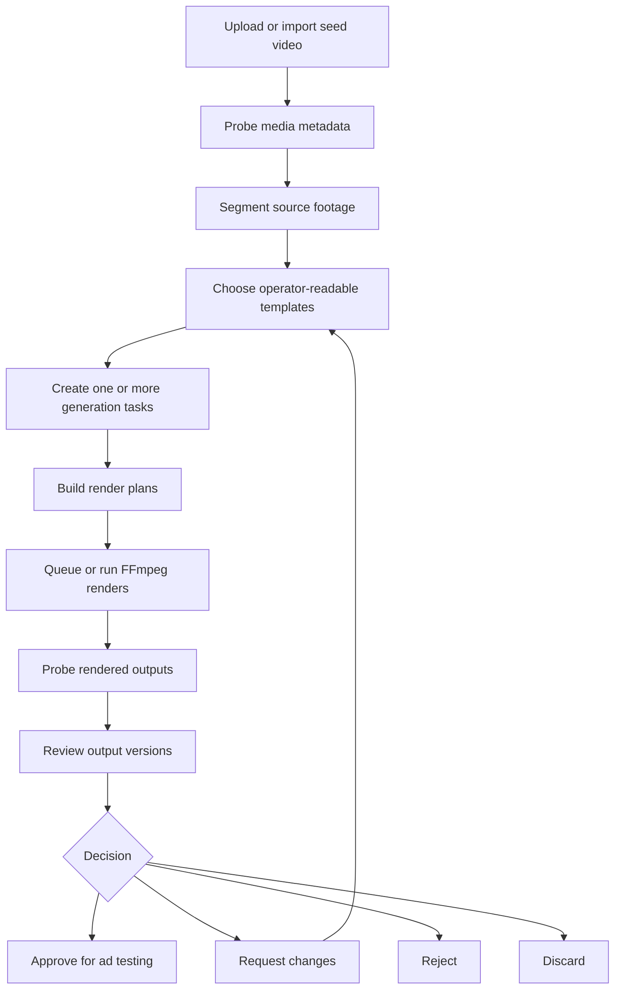
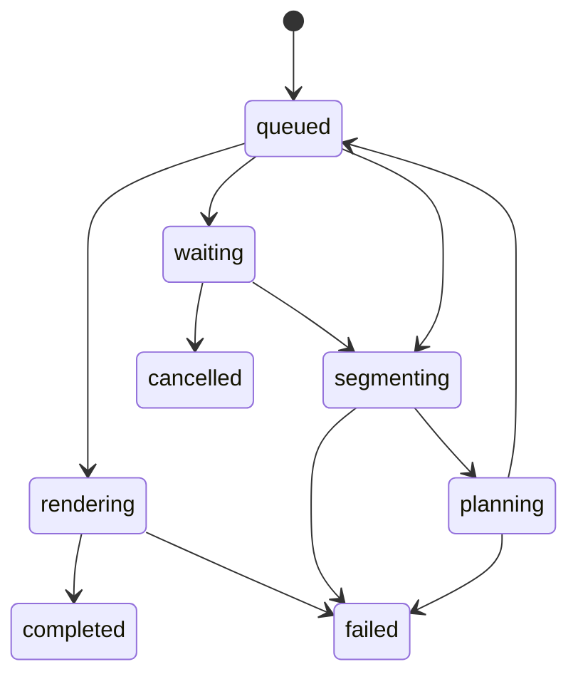
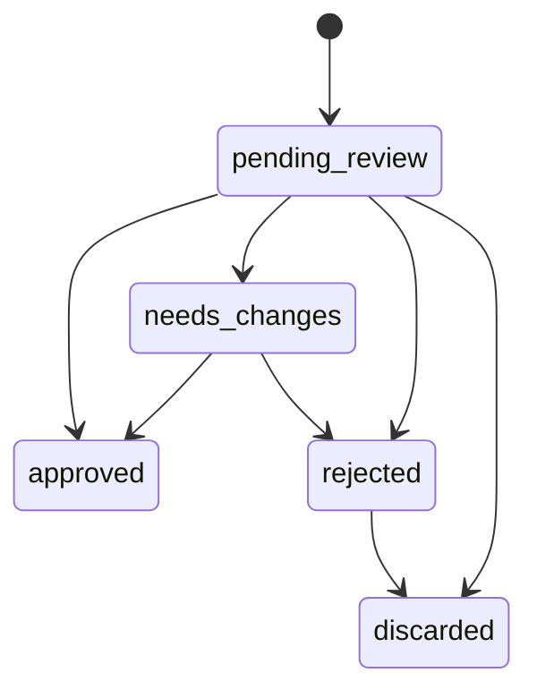

# flashcutter Workflow

## Product Loop

## Operator Workflow

1. Add a seed video from upload or URL import.
2. Confirm the asset is ready and has media metadata.
3. Create or edit templates that describe creative goal, editing rules, delivery
   format, transformations, and review notes.
4. Create batch tasks for one seed video across several templates.
5. Queue tasks and monitor progress.
6. Open the review workspace.
7. Watch outputs, inspect metadata, and record approval or change feedback.

## Task State Flow

## Review State Flow

