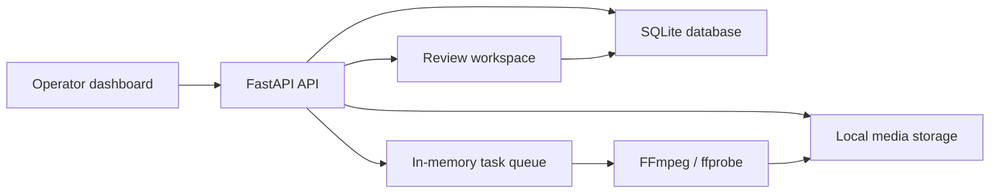

# flashcutter Architecture

flashcutter is an operator-facing MVP for turning rights-cleared, human-shot seed
videos into short-video ad variants. The system is intentionally local-first for
the MVP: FastAPI owns orchestration and persistence, FFmpeg owns media work, and
the React dashboard gives operators a production workflow.

## System Components

## Backend

- Framework: FastAPI
- Persistence: SQLAlchemy models on SQLite
- Media operations: FFmpeg and ffprobe
- Storage root: `backend/storage`
- Tests: `backend/tests`

Core model groups:

- `Asset`: uploaded or imported seed video plus probed media metadata.
- `Segment`: fixed-interval source clips generated from an asset.
- `Template`: operator-readable JSON spec for selection, delivery, and creative
  transformations.
- `GenerationTask`: a queued or executed render job for one asset/template pair.
- `RenderPlan`: normalized plan derived from the template and task params.
- `OutputVideo`: rendered MP4 plus review status and feedback.

## Frontend

- Framework: React + TypeScript + Vite
- Main operator pages:
  - Seed videos
  - Templates
  - Create variants
  - Tasks
  - Review outputs

The frontend talks to the FastAPI backend through `frontend/src/api/client.ts`.

## Rendering Path

1. Probe uploaded media with `ffprobe`.
2. Split the asset into reusable fixed-interval segments.
3. Normalize template JSON into a render plan.
4. Render with fast concat when no filters are needed.
5. Render through a transcode/filter path when dimensions, FPS, fit mode, or
   transformations are requested.
6. Probe the output and persist output metadata for review.

## MVP Boundaries

- The queue is in-memory and not durable across process restarts.
- SQLite is suitable for local MVP work, not multi-worker production use.
- Phone/password login is a local gate; protected API routes are not yet
  enforced with production authentication.
- Source rights and meaningful creative treatment are product requirements; the
  system is not intended to bypass platform detection.

## Production Replacement Points

- Replace the in-memory queue with Redis/RQ, Celery, or another durable worker.
- Add migrations with Alembic before schema changes become operationally risky.
- Move media storage to object storage when operators need shared access.
- Enforce server-side auth and real SMS verification.
- Add render worker isolation, retry policies, and output artifact lifecycle
  management.
