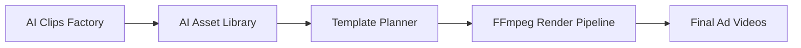
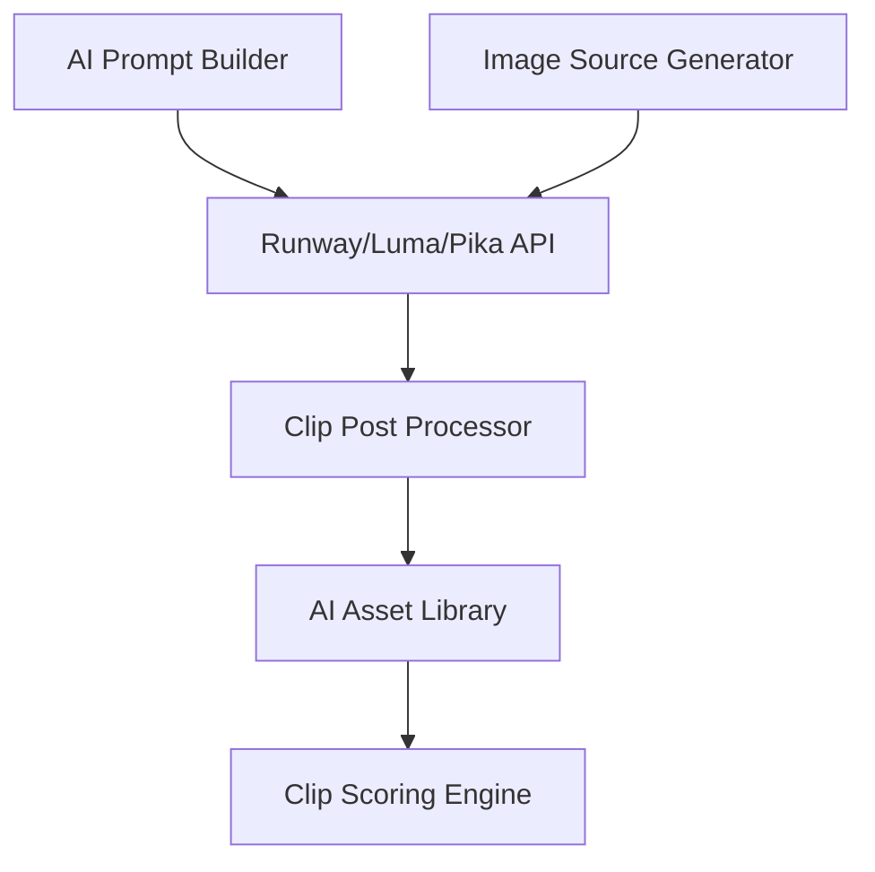
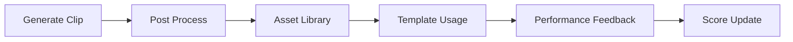

# AI Clips Factory（AICF）需求文档 v0.1

> Deprecated: AI Clips Factory 的实现方向已收缩为“仿制生成”。新实现以 [ai_clips_factory.md](ai_clips_factory.md) v0.3 为准；本文仅保留作历史背景参考。

## 项目定位

AI Clips Factory（AICF）是广告素材系统中的一个“AI资产工厂”模块。

它不负责生成完整广告，而是：

> 批量生成、管理、评分、复用短AI视频资产（AI Clips）。

这些 AI Clips 将作为：

- Hook
- CTA
- B-roll
- Reaction
- Meme
- Product Motion

被主广告流水线调用。

## 一、目标

### 核心目标

建立一个：

```text
低成本
高复用
可缓存
可评分
可工业化
```

的 AI 视频资产系统。

## 非目标（重要）

AICF 不负责：

- 生成完整广告
- 替代真人广告主流程
- 长视频生成
- 实时逐用户AI生成
- 高复杂导演级镜头控制

## 二、系统角色

AICF 在整体系统中的位置：



## 三、AI Clip 类型

### 1. Hook Clips（最高优先级）

用途：

- 前3秒吸引注意力。

示例：

- 小猫震惊。
- 人物夸张反应。
- 产品突然出现。
- 表情镜头。

时长：

```text
1~4秒
```

### 2. CTA Clips

用途：

- 广告结尾行动引导。

示例：

- pointing gesture
- happy reaction
- “立即购买”类动态镜头

时长：

```text
2~5秒
```

### 3. B-roll Clips

用途：

- 转场
- 氛围
- 填充
- 产品特写

示例：

- 产品旋转
- 慢动作
- lifestyle镜头
- 手部动作

时长：

```text
1~5秒
```

### 4. Reaction Clips

用途：

- 表情反馈
- meme
- 社媒风格广告

示例：

- 惊讶
- 开心
- 无语
- 尴尬

时长：

```text
1~3秒
```

### 5. Meme Clips

用途：

- 搞笑
- 病毒传播
- 社媒互动

示例：

- 猫狗聊天
- 拟人短剧
- AI动物口播

时长：

```text
4~10秒
```

## 四、核心设计原则

### 1. AI Clip 是资产，不是一次性视频

每个 Clip 必须：

- 可复用。
- 可缓存。
- 可评分。
- 可标签化。
- 可参数化。

### 2. 离线生成优先

禁止：

```text
用户实时生成 AI视频
```

推荐：

```text
后台批量生成 AI资产
```

进入：

```text
AI Asset Library
```

用户使用时：

```text
直接调用
```

### 3. 短镜头优先

推荐长度：

| 类型 | 推荐时长 |
| --- | --- |
| Hook | 2~3秒 |
| CTA | 2~4秒 |
| B-roll | 1~3秒 |
| Reaction | 1~2秒 |

禁止：

```text
长AI广告
```

### 4. image-to-video 优先

禁止：

```text
text -> long video
```

推荐：

```text
image -> short motion clip
```

原因：

- 更稳定。
- 成本更低。
- 风格一致性更强。
- 更适合缓存复用。

## 五、技术架构



## 六、推荐 AI Provider

| Provider | 用途 |
| --- | --- |
| Runway | Hook / CTA / B-roll |
| Luma | lifestyle / cinematic B-roll |
| Pika | meme / 搞笑动物 |
| FLUX | 静态图生成 |
| ElevenLabs | TTS |

## 七、模块设计

### 1. ai_asset_factory/

目录：

```text
backend/app/services/ai_asset_factory/
```

结构：

```text
ai_asset_factory/
├── providers/
│   ├── runway_provider.py
│   ├── luma_provider.py
│   └── pika_provider.py
│
├── generators/
│   ├── hook_generator.py
│   ├── cta_generator.py
│   ├── broll_generator.py
│   ├── reaction_generator.py
│   └── meme_generator.py
│
├── scoring/
│   ├── clip_score_service.py
│   └── roi_score_service.py
│
├── postprocess/
│   ├── normalize_service.py
│   ├── subtitle_overlay.py
│   └── audio_mix_service.py
│
└── asset_library/
    ├── asset_indexer.py
    └── asset_search.py
```

## 八、核心接口

### 1. Clip Generator Interface

```python
class AIClipGenerator:

    async def generate_clip(
        self,
        image_path: str,
        prompt: str,
        duration: int,
        output_path: str
    ) -> str:
        pass
```

### 2. AI Provider Interface

```python
class AIVideoProvider:

    async def image_to_video(
        self,
        image_path: str,
        prompt: str,
        duration: int = 4
    ) -> str:
        pass
```

## 九、AI Asset 数据结构

### ai_assets

```sql
asset_id
provider
asset_type
duration
prompt
source_image_path
output_video_path
thumbnail_path
generation_cost
generation_time
usage_count
roi_score
avg_ctr_lift
status
created_at
```

### ai_asset_tags

```sql
asset_id
tag
```

## 十、资产标签体系

每个 AI Clip 必须可搜索。

标签：

```text
cute
funny
surprised
reaction
cat
dog
ugc
cinematic
hook
cta
hard_sell
soft_sell
product
luxury
cheap
emotional
meme
```

## 十一、Clip 生命周期



## 十二、评分系统

### Clip Score

评分维度：

| 指标 | 权重 |
| --- | --- |
| CTR提升 | 高 |
| 完播率 | 高 |
| 使用频率 | 中 |
| 拒审率 | 高 |
| 生成成本 | 中 |

### ROI Score

公式示例：

```text
ROI Score =
(CTR Lift × Usage Count)
÷ Generation Cost
```

## 十三、成本模型

### 核心原则

AI Clip：

```text
必须复用
```

而不是：

```text
一次性使用
```

### 成本评估示例

| Clip | 生成成本 | 使用次数 | 单次摊销 |
| --- | --- | --- | --- |
| 猫咪Hook | 1.4 RMB | 200 | 0.007 |
| CTA镜头 | 2 RMB | 50 | 0.04 |
| B-roll | 1 RMB | 300 | 0.003 |

## 十四、多用户系统支持

每个用户：

```text
可拥有自己的 AI资产库
```

结构：

```sql
user_ai_assets
```

字段：

```text
user_id
asset_id
is_private
usage_limit
custom_tags
```

## 十五、用户功能

用户可：

- 收藏 AI clips
- 建立自己的 Hook 库
- 建立自己的 CTA 库
- 上传参考图
- 批量生成变体
- 查看 Clip ROI
- 查看使用次数

## 十六、MVP范围

MVP 仅实现：

### 必做

- Runway image-to-video
- Hook generator
- B-roll generator
- AI asset library
- Clip tagging
- Template integration
- FFmpeg integration

### 不做

- 实时生成
- 多 provider 自动 fallback
- 自动 prompt 优化
- AI 长视频
- AI 整片广告
- 自动导演系统

## 十七、最终定位（关键）

AICF 的本质不是：

```text
AI视频生成平台
```

而是：

## “广告AI资产工厂”

核心价值：

```text
低成本
高复用
高CTR
可缓存
可工业化
```
