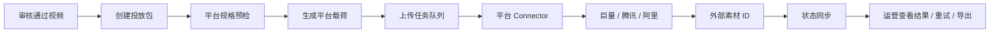

# Ad Platform Export 接口层设计 v0.1

## 1. 模块定位

Ad Platform Export 负责把 Flashcutter 已审核通过的视频成片，批量推送到外部广告平台的素材库或创意草稿区。

目标平台第一批：

```text
巨量引擎 / Ocean Engine
腾讯广告 / 广点通
阿里妈妈 / 阿里广告平台
```

核心原则：

```text
Flashcutter 管生产、审核、投放包、状态追踪。
外部平台 connector 管认证、字段映射、上传、平台审核状态同步。
```

不要把业务流程直接写死成某一家平台的 API 字段。平台 API 版本、账户权限、素材规格和审核回执都可能变化。

---

## 2. MVP 范围

### 做

```text
1. 选择一批审核通过的视频
2. 创建一个投放推送批次
3. 为每个平台配置账户授权
4. 执行视频素材上传
5. 保存外部素材 ID / creative ID / upload ID
6. 展示每条视频在各平台的上传与审核状态
7. 失败可重试，失败原因可读
```

### 暂不做

```text
1. 自动创建完整广告计划 / 单元 / 出价
2. 自动预算管理
3. 自动投放 ROI 优化
4. 跨平台自动调参
5. 绕过平台审核或素材检测
```

MVP 先把“成片进入平台素材库 / 创意草稿”跑通，后续再接计划、单元、投放策略。

---

## 3. 总体流程



---

## 4. 核心对象

### 4.1 Export Package

一次运营动作。比如“5 月新品 A/B 组素材推送到巨量和腾讯”。

```json
{
  "package_id": "pkg_001",
  "name": "2026-05 新品投放素材包",
  "created_by": "user_001",
  "target_platforms": ["oceanengine", "tencent_ads"],
  "status": "draft",
  "output_video_ids": [101, 102, 103],
  "metadata": {
    "campaign_name": "新品冷启动",
    "product_name": "便携咖啡杯",
    "landing_page_url": "https://example.com/product",
    "industry": "ecommerce"
  }
}
```

状态：

```text
draft
prechecking
ready
uploading
partial_success
succeeded
failed
cancelled
```

### 4.2 Export Item

一个视频推送到一个平台的一条记录。

```json
{
  "item_id": "item_001",
  "package_id": "pkg_001",
  "output_video_id": 101,
  "platform": "oceanengine",
  "account_id": "external_account_001",
  "status": "uploaded",
  "external_material_id": "mat_123",
  "external_creative_id": null,
  "platform_review_status": "pending",
  "error_message": null
}
```

状态：

```text
queued
prechecking
uploading
uploaded
review_pending
review_approved
review_rejected
failed
retrying
cancelled
```

### 4.3 Platform Account

平台授权账户，不把 token 暴露给普通用户。

```json
{
  "account_id": "acct_001",
  "platform": "oceanengine",
  "display_name": "某品牌巨量账户",
  "external_advertiser_id": "123456",
  "auth_type": "oauth2",
  "status": "active",
  "scopes": ["material_upload", "creative_manage"]
}
```

---

## 5. 数据库表

### 5.1 ad_platform_accounts

```sql
CREATE TABLE ad_platform_accounts (
    id INTEGER PRIMARY KEY,
    platform TEXT NOT NULL,
    display_name TEXT NOT NULL,
    external_advertiser_id TEXT,
    auth_type TEXT NOT NULL,
    token_secret_ref TEXT NOT NULL,
    scopes JSON,
    status TEXT NOT NULL,
    created_at TIMESTAMP NOT NULL,
    updated_at TIMESTAMP NOT NULL
);
```

### 5.2 ad_export_packages

```sql
CREATE TABLE ad_export_packages (
    id INTEGER PRIMARY KEY,
    name TEXT NOT NULL,
    created_by_user_id INTEGER,
    target_platforms JSON NOT NULL,
    metadata_json JSON,
    status TEXT NOT NULL,
    created_at TIMESTAMP NOT NULL,
    updated_at TIMESTAMP NOT NULL,
    submitted_at TIMESTAMP,
    finished_at TIMESTAMP
);
```

### 5.3 ad_export_items

```sql
CREATE TABLE ad_export_items (
    id INTEGER PRIMARY KEY,
    package_id INTEGER NOT NULL,
    output_video_id INTEGER NOT NULL,
    platform TEXT NOT NULL,
    platform_account_id INTEGER NOT NULL,
    status TEXT NOT NULL,
    precheck_json JSON,
    payload_json JSON,
    external_material_id TEXT,
    external_creative_id TEXT,
    platform_review_status TEXT,
    error_message TEXT,
    retry_count INTEGER DEFAULT 0,
    created_at TIMESTAMP NOT NULL,
    updated_at TIMESTAMP NOT NULL,
    submitted_at TIMESTAMP,
    finished_at TIMESTAMP
);
```

### 5.4 ad_export_events

```sql
CREATE TABLE ad_export_events (
    id INTEGER PRIMARY KEY,
    item_id INTEGER NOT NULL,
    status TEXT NOT NULL,
    message TEXT,
    raw_response_json JSON,
    created_at TIMESTAMP NOT NULL
);
```

---

## 6. Connector 抽象

```python
class AdPlatformConnector:
    platform: str

    async def validate_account(self, account: PlatformAccount) -> PlatformAccountStatus:
        ...

    async def precheck_video(
        self,
        video: OutputVideo,
        metadata: dict,
        account: PlatformAccount,
    ) -> PlatformPrecheckResult:
        ...

    async def upload_material(
        self,
        video: OutputVideo,
        payload: PlatformMaterialPayload,
        account: PlatformAccount,
    ) -> PlatformUploadResult:
        ...

    async def create_creative_draft(
        self,
        material: PlatformUploadResult,
        payload: PlatformCreativePayload,
        account: PlatformAccount,
    ) -> PlatformCreativeResult:
        ...

    async def sync_review_status(
        self,
        external_material_id: str,
        account: PlatformAccount,
    ) -> PlatformReviewStatus:
        ...
```

MVP connector：

```text
MockAdPlatformConnector
OceanEngineConnector
TencentAdsConnector
AlimamaConnector
```

第一阶段建议只实现 `MockAdPlatformConnector` + `OceanEngineConnector` 的上传骨架。腾讯和阿里先做配置、预检、mock 上传。

---

## 7. 平台适配边界

### 7.1 统一内部素材规格

Flashcutter 先输出自己的规范：

```json
{
  "file_path": ".../output.mp4",
  "filename": "product-hook-v1.mp4",
  "duration_seconds": 10.2,
  "width": 1080,
  "height": 1920,
  "fps": 30,
  "file_size_bytes": 18300000,
  "mime_type": "video/mp4",
  "review_status": "approved",
  "rights_checked": true
}
```

平台 connector 再转成各平台字段。

### 7.2 平台规格预检

推送前必须检查：

```text
1. 成片必须 approved
2. 视频文件存在且可访问
3. rights_checked 为 true
4. 时长、尺寸、码率、文件大小符合目标平台配置
5. 必要业务字段齐全：商品名、落地页、品牌、行业、素材标题
6. 平台账户授权有效
```

预检失败不进入上传队列，要给运营可执行提示：

```text
“视频 102 无法推送到腾讯广告：缺少落地页 URL。请在投放包信息中补充。”
```

---

## 8. API 设计

### 8.1 获取平台账户

```http
GET /api/ad-platforms/accounts
```

### 8.2 创建投放包

```http
POST /api/ad-exports/packages
```

Request：

```json
{
  "name": "新品冷启动素材包",
  "output_video_ids": [101, 102, 103],
  "target_platforms": ["oceanengine", "tencent_ads"],
  "metadata": {
    "campaign_name": "新品冷启动",
    "product_name": "便携咖啡杯",
    "landing_page_url": "https://example.com/product",
    "industry": "ecommerce"
  }
}
```

### 8.3 投放包预检

```http
POST /api/ad-exports/packages/{package_id}/precheck
```

Response：

```json
{
  "package_id": 1,
  "ready_count": 5,
  "blocked_count": 1,
  "items": [
    {
      "output_video_id": 101,
      "platform": "oceanengine",
      "status": "ready",
      "warnings": []
    },
    {
      "output_video_id": 102,
      "platform": "tencent_ads",
      "status": "blocked",
      "errors": ["缺少 landing_page_url"]
    }
  ]
}
```

### 8.4 提交上传

```http
POST /api/ad-exports/packages/{package_id}/submit
```

### 8.5 查询投放包状态

```http
GET /api/ad-exports/packages/{package_id}
```

### 8.6 重试单条失败

```http
POST /api/ad-exports/items/{item_id}/retry
```

### 8.7 同步审核状态

```http
POST /api/ad-exports/packages/{package_id}/sync-status
```

---

## 9. Worker 设计

```python
@celery.task
def submit_ad_export_item(item_id: int):
    """
    1. 读取 export item
    2. 读取 output video 和 platform account
    3. 重新做轻量预检
    4. 调 connector.upload_material
    5. 保存 external_material_id
    6. 如开启 creative draft，则创建创意草稿
    """

@celery.task
def sync_ad_export_item_status(item_id: int):
    """
    1. 读取 external_material_id / creative_id
    2. 调 connector.sync_review_status
    3. 更新 platform_review_status
    4. 保存 raw response 到 ad_export_events
    """
```

---

## 10. 前端流程

新增页面：

```text
frontend/src/pages/AdPlatformExportPage.tsx
```

操作流：

```text
审核页选择成片
→ 点击“推送到广告平台”
→ 弹出投放包对话框
→ 选择平台账户
→ 填商品名 / 落地页 / 行业 / 素材标题
→ 预检
→ 提交上传
→ 进入推送状态页
```

关键 UI 要求：

```text
1. 不让运营理解 API 字段
2. 错误必须变成可操作提示
3. 每条视频每个平台独立显示状态
4. 支持失败重试
5. 支持导出 CSV：视频名、平台、外部素材 ID、审核状态、失败原因
```

---

## 11. 安全与合规

必须实现：

```text
1. 只有 approved 的成片可以推送
2. 保留 rights check 记录
3. 平台 access token 加密保存，前端不可见
4. 所有上传 payload 和平台响应留审计日志
5. 用户只能使用自己 workspace 授权的平台账户
6. 不提供绕过审核、规避检测、伪装素材的能力
7. 删除或撤回只做平台允许范围内的正常操作
```

---

## 12. 开发拆分

### PR 1：模型与 Mock Connector

```text
ad_platform_accounts
ad_export_packages
ad_export_items
ad_export_events
MockAdPlatformConnector
```

### PR 2：投放包 API

```text
创建投放包
预检
提交上传
查询状态
失败重试
```

### PR 3：前端推送流程

```text
审核页选择成片
投放包对话框
预检结果
推送状态页
```

### PR 4：巨量引擎 Connector

```text
OAuth / token 管理
视频素材上传
素材 ID 回写
审核状态同步
```

### PR 5：腾讯 / 阿里 Connector 骨架

```text
账户配置
规格预检
mock 上传
真实上传字段映射
```

---

## 13. MVP 验收标准

```text
1. 运营能从审核页选择 5 条 approved 视频
2. 选择巨量和腾讯两个目标平台
3. 系统生成 10 条 export item
4. 预检能指出缺失落地页、素材未审核、尺寸不合规等问题
5. mock connector 能模拟成功、失败、审核中、审核拒绝
6. 成功项能保存 external_material_id
7. 失败项能重试
8. 状态页能按平台查看上传和审核状态
```

---

## 14. 外部平台资料备注

当前公开资料可确认这些平台有开放平台、素材上传或创意管理相关能力，但真实接入必须以申请到的开发者账号和最新官方文档为准：

```text
巨量引擎：Marketing API / 开放平台 SDK / 创意能力接口
腾讯广告：素材中心、视频/图片/品牌标识上传管理
阿里妈妈：创意中心素材上传 API
```
