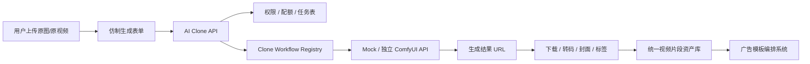
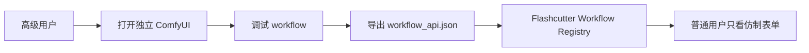
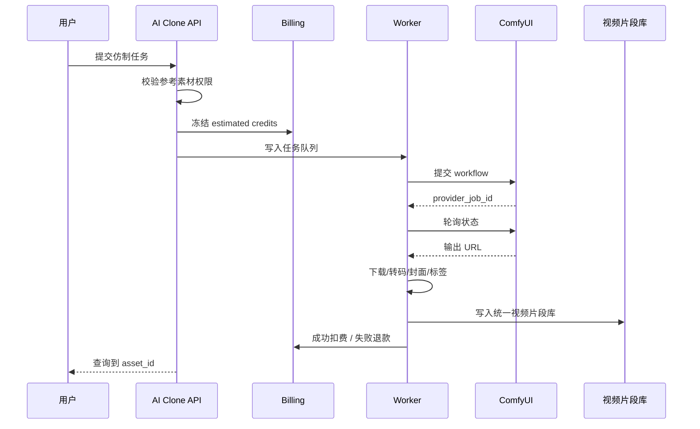

# AI Clips Factory 需求文档：仿制生成版 v0.3

## 1. 模块定位

AI Clips Factory 不再做通用 AI 素材工厂，也不再维护多种业务化生成类型。

新的定位是：

> **只保留“仿制”功能：用户提供原图或原视频，再用 prompt 驱动生成相似但可重新入库的视频片段。**

Flashcutter 负责：

```text
1. 用户与权限
2. 参考素材上传与归属
3. prompt 与仿制任务
4. 计费 / 配额 / 任务状态
5. 生成结果下载、转码、封面、标签
6. 进入统一视频片段资产库
7. 被模板编排系统复用
```

生成执行层负责：

```text
1. 图生视频 / 视频生视频 / 风格保持
2. ComfyUI workflow 执行
3. 模型参数、节点图、采样器、LoRA、ControlNet 等复杂控制
```

如果后续有复杂交互控制需求，不在 Flashcutter 里自研 UI，而是部署一个独立 ComfyUI，由 Flashcutter 通过接口连接。

---

## 2. 产品目标

MVP 只解决一个问题：

```text
我有一张图或一个短视频，希望生成一个相似风格、相似主体、相似镜头语言的新 clip。
```

典型用途：

```text
1. 用产品图仿制一段可做 B-roll 的产品动效
2. 用已有 Hook 视频仿制同风格开场
3. 用宠物/人物参考视频仿制一个相似动作或口播氛围
4. 用商品海报或图片仿制一个短视频片段
5. 为同一个广告模板补充更多相似素材
```

生成结果不进入单独 AI 素材池，而是进入统一的“视频片段”资产库。对模板系统来说，它和用户上传的视频片段没有区别，只是多了生成来源和任务记录。

---

## 3. 非目标

MVP 不做：

```text
1. 通用 AI 整片广告生成
2. 猫咪聊天 / CTA / B-roll 等固定业务 workflow 菜单
3. 多 Provider 自动调度
4. 自研 ComfyUI 节点编辑器
5. 在 Flashcutter 里复刻 ComfyUI 参数面板
6. 自建 GPU 推理集群
7. 实时高并发生成
8. 绕过平台审核或伪造真实素材来源
```

复杂控制交互统一交给独立 ComfyUI：

```text
Flashcutter 只打开外部 ComfyUI 工作台或保存 workflow 引用。
Flashcutter 不负责绘制节点图、编辑节点参数、调试模型链路。
```

---

## 4. 总体架构



复杂控制路径：



---

## 5. 核心原则

### 5.1 只有一个用户心智：仿制

前端不要再让用户选择“生成 Hook / CTA / B-roll / Meme”。这些都是素材用途，不是生成入口。

用户只需要回答：

```text
1. 参考素材是什么？
2. 想像它什么？
3. 想改哪里？
4. 生成多长？
5. 生成后放到哪个资产标签下？
```

### 5.2 AI 生成 clip 与用户视频片段一视同仁

生成结果统一进入视频片段库：

```text
asset_kind = video
asset_type = hook / cta / broll / reaction / product_motion / custom
source_type = ai_clone
```

模板系统按标签、类型、时长、可见性检索，不关心它是上传的还是 AI 生成的。

### 5.3 Flashcutter 不接触复杂生成控制

普通用户看到的是业务表单：

```text
参考图 / 参考视频
仿制目标 prompt
负向提示
相似度
运动强度
时长
输出用途标签
```

普通用户不能看到：

```text
ComfyUI 节点图
模型参数
采样器
LoRA 细节
ControlNet 权重
底层 API Key
```

需要复杂控制时：

```text
1. 部署独立 ComfyUI
2. 设计人员在 ComfyUI 内完成 workflow 调试
3. 导出 workflow_api.json
4. 管理员在 Flashcutter 注册该 workflow
5. 普通用户继续使用简化仿制表单
```

### 5.4 Workflow 版本锁定

每个仿制 workflow 必须保存：

```text
workflow_id
version
mode: image_to_video / video_to_video
workflow_api_json
参数 schema
预估 credits
测试输入
测试输出
上线状态
ComfyUI endpoint
```

---

## 6. MVP Workflow

第一版只保留两个工作流。

### 6.1 image_clone_video_v1

用途：

```text
原图仿制短视频，适合产品图、海报、人物图、宠物图。
```

输入：

```json
{
  "reference_image": "required",
  "prompt": "保持主体和画面风格，生成轻微镜头运动的短视频",
  "negative_prompt": "blurry, distorted, low quality",
  "duration": 4,
  "similarity": 0.75,
  "motion_strength": 0.45,
  "asset_type": "broll",
  "tags": ["product", "clone"]
}
```

输出：

```text
mp4
封面图
统一视频片段资产
来源记录：ai_clone_job_id
```

### 6.2 video_clone_clip_v1

用途：

```text
原视频仿制短 clip，适合复刻动作、镜头语言、口播氛围、产品展示节奏。
```

输入：

```json
{
  "reference_video": "required",
  "prompt": "保留原视频的镜头节奏和主体动作，生成相似广告片段",
  "negative_prompt": "text artifacts, watermark, deformation",
  "duration": 5,
  "similarity": 0.7,
  "motion_strength": 0.55,
  "asset_type": "hook",
  "tags": ["hook", "ugc", "clone"]
}
```

输出：

```text
mp4
封面图
统一视频片段资产
来源记录：ai_clone_job_id
```

---

## 7. 数据模型

### 7.1 ai_clone_workflows

```sql
CREATE TABLE ai_clone_workflows (
    workflow_id TEXT PRIMARY KEY,
    version TEXT NOT NULL,
    name TEXT NOT NULL,
    mode TEXT NOT NULL,
    provider TEXT NOT NULL,
    endpoint_ref TEXT,
    manifest_json JSON NOT NULL,
    workflow_api_json JSON NOT NULL,
    params_schema_json JSON NOT NULL,
    status TEXT NOT NULL,
    estimated_credits INTEGER NOT NULL,
    estimated_seconds INTEGER,
    created_at TIMESTAMP NOT NULL,
    updated_at TIMESTAMP NOT NULL
);
```

mode：

```text
image_to_video
video_to_video
```

provider：

```text
mock
comfyui
```

### 7.2 ai_clone_jobs

```sql
CREATE TABLE ai_clone_jobs (
    job_id TEXT PRIMARY KEY,
    user_id TEXT NOT NULL,
    workflow_id TEXT NOT NULL,
    provider TEXT NOT NULL,
    provider_job_id TEXT,
    reference_asset_id TEXT,
    reference_asset_type TEXT NOT NULL,
    input_params_json JSON NOT NULL,
    status TEXT NOT NULL,
    estimated_credits INTEGER NOT NULL,
    actual_credits INTEGER,
    output_asset_id TEXT,
    error_message TEXT,
    created_at TIMESTAMP NOT NULL,
    submitted_at TIMESTAMP,
    finished_at TIMESTAMP
);
```

状态：

```text
queued
checking_balance
submitted
running
succeeded
failed
refunded
cancelled
```

### 7.3 ai_assets / video clips

继续使用统一视频片段资产表，增加来源字段即可：

```text
source_type = upload | ai_clone | ai_import
source_job_id
reference_asset_id
```

如果当前表结构暂时没有这些字段，MVP 可先写入：

```text
provider = ai_clone
prompt = input prompt
tags = clone / image_to_video / video_to_video
```

---

## 8. API 设计

### 8.1 获取仿制 workflow

```http
GET /api/ai-clone/workflows
```

Response：

```json
{
  "items": [
    {
      "workflow_id": "image_clone_video_v1",
      "name": "原图仿制视频",
      "mode": "image_to_video",
      "estimated_credits": 8,
      "estimated_seconds": 90,
      "params_schema": {}
    }
  ]
}
```

### 8.2 创建仿制任务

```http
POST /api/ai-clone/jobs
```

Request：

```json
{
  "workflow_id": "image_clone_video_v1",
  "reference_asset_id": "asset_001",
  "reference_asset_type": "image",
  "params": {
    "prompt": "保留产品主体，生成干净电商广告镜头",
    "negative_prompt": "blurry, watermark",
    "duration": 4,
    "similarity": 0.75,
    "motion_strength": 0.45,
    "asset_type": "broll",
    "tags": ["product", "clean", "clone"]
  },
  "visibility": "private"
}
```

Response：

```json
{
  "job_id": "clone_job_001",
  "status": "queued",
  "estimated_credits": 8
}
```

### 8.3 查询任务状态

```http
GET /api/ai-clone/jobs/{job_id}
```

Response：

```json
{
  "job_id": "clone_job_001",
  "status": "succeeded",
  "workflow_id": "image_clone_video_v1",
  "asset_id": "clip_001",
  "error_message": null
}
```

---

## 9. 独立 ComfyUI 对接

### 9.1 部署方式

```text
Flashcutter
  - 业务系统
  - 用户、任务、计费、资产库

ComfyUI Service
  - 独立部署
  - 可由设计/技术人员进入节点 UI
  - 暴露 prompt / queue / history / file download API
```

### 9.2 ComfyUIClient

```python
class ComfyUIClient:
    async def submit_workflow(self, workflow_api_json: dict, params: dict) -> str:
        ...

    async def get_job_status(self, provider_job_id: str) -> dict:
        ...

    async def get_outputs(self, provider_job_id: str) -> list[str]:
        ...
```

### 9.3 管理规则

```text
1. ComfyUI endpoint 只在后端配置，前端不可见。
2. 普通用户不能提交任意 workflow JSON。
3. 只有管理员能注册 / 更新 workflow。
4. workflow 更新必须生成新 version。
5. 生产任务必须绑定已上线 workflow version。
```

---

## 10. 前端设计

原 AICF 页面收缩为一个入口：

```text
视频片段库
  ├── 上传片段
  ├── 上传参考图
  └── 仿制生成
```

仿制生成对话框：

```text
1. 选择参考素材：图片或视频
2. 自动选择 workflow：图片走 image_clone_video_v1，视频走 video_clone_clip_v1
3. 填 prompt：想像它什么
4. 填 negative prompt：不希望出现什么
5. 调整相似度：低 / 中 / 高
6. 调整运动强度：弱 / 中 / 强
7. 选择时长
8. 选择生成后用途标签：hook / broll / cta / reaction / custom
9. 提交任务
10. 完成后在视频片段库展示
```

错误提示必须是功能化提示：

```text
参考图太大：请压缩到 10MB 以内或改用 JPG/PNG。
参考视频太长：请截取 3-8 秒片段后再仿制。
生成失败：本次 credits 已退回，可修改 prompt 后重新发起。
ComfyUI 不可用：生成服务暂时离线，任务未扣费。
```

---

## 11. 安全与隔离

必须实现：

```text
1. 用户只能使用自己有权访问的参考素材。
2. 用户只能查看自己的 private 生成结果。
3. workspace / public_pool 按统一资产库规则访问。
4. 上传参考图和参考视频必须检查文件类型、大小、时长。
5. 用户不能读取 provider API key 或 ComfyUI endpoint。
6. 用户不能提交任意 workflow JSON。
7. 任务失败必须退款或释放冻结 credits。
8. 生成结果必须进入审核/可追踪资产流，不直接进入投放。
```

---

## 12. Worker 流程



---

## 13. 开发任务拆分

### PR 1：文档与命名收缩

```text
重命名 AICF 产品口径为 AI Clone
移除 Hook/CTA/B-roll 固定生成工作流设计
保留统一视频片段库入口
```

### PR 2：Clone Workflow Registry

```text
image_clone_video_v1
video_clone_clip_v1
workflow manifest
params schema
参数校验
```

### PR 3：Mock Clone Client

```text
MockComfyUIClient
submit/status/output
本地测试生成占位 mp4
```

### PR 4：任务 API 与计费

```text
POST /api/ai-clone/jobs
GET /api/ai-clone/jobs/{job_id}
冻结 credits
失败退款
```

### PR 5：Worker 与资产入库

```text
提交 workflow
轮询状态
下载/转码/缩略图
写入统一视频片段库
```

### PR 6：视频片段库前端仿制入口

```text
仿制生成对话框
参考图片/视频选择
prompt 表单
任务状态
完成后回到视频片段库
```

### PR 7：独立 ComfyUI 接入

```text
ComfyUI endpoint 配置
workflow_api.json 提交
history 查询
输出文件下载
连接健康检查
```

---

## 14. MVP 验收标准

```text
1. 用户能选一张参考图，输入 prompt，提交仿制任务。
2. 用户能选一个参考视频，输入 prompt，提交仿制任务。
3. mock provider 能返回生成结果并入库为视频片段。
4. 生成 clip 在视频片段库里和上传 clip 一起展示。
5. 模板 slot 能选择 AI 仿制 clip。
6. 失败任务有可读原因并退款。
7. 普通用户看不到 ComfyUI 节点图、endpoint 和 API key。
8. 管理员可以注册独立 ComfyUI workflow。
```

---

## 15. 关键工程建议

第一版仍然先用 mock。

不要一开始真实扣费、真实调用、真实视频生成。先跑通：

```text
参考图/视频
→ prompt
→ mock 仿制任务
→ 入库为视频片段
→ 模板 slot 选择
→ 审核与投放流程复用
```

再接独立 ComfyUI。
