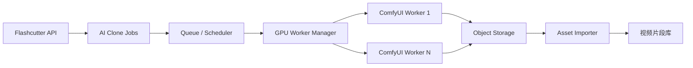
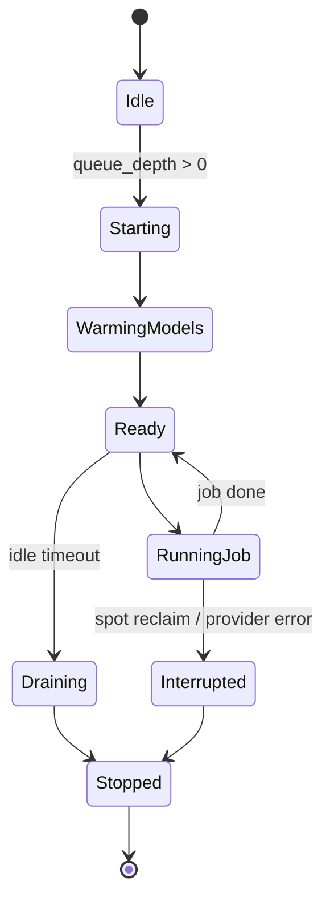

# ComfyUI 生成基建方案与国内 4090 分时平台选型 v0.2

## 1. 目标

Flashcutter 的 AI Clone 需要一个独立 ComfyUI 执行层。初期任务量不稳定，因此基础设施目标不是“长期占满 GPU”，而是：

```text
1. GPU 可按需启动和释放
2. 队列可见、可计时、可失败重试
3. 模型、workflow、输出文件持久化
4. Flashcutter 不暴露 ComfyUI endpoint 和 provider token
5. 后续可从单机升级到多 worker
```

推荐先做“控制平面常驻 + GPU worker 弹性启动”的架构。

---

## 2. 推荐架构



### 常驻组件

```text
Flashcutter API
数据库
任务队列
对象存储
ComfyUI workflow registry
GPU worker manager
```

这些组件运行在普通 CPU 云主机上即可。

### 弹性组件

```text
ComfyUI GPU worker
模型缓存盘
临时输出目录
```

当队列有任务时启动 GPU worker；空闲超过阈值后释放。

---

## 3. 为什么不直接 24 小时运行 GPU

初期任务不饱满时，最贵的是 GPU 空闲时间。

推荐策略：

```text
0 个任务：GPU worker = 0
1-3 个任务：启动 1 台 GPU worker
队列积压：按最大并发上限增加 worker
空闲 10-20 分钟：释放 worker
```

代价：

```text
1. 冷启动需要 2-8 分钟，取决于镜像、模型和云盘挂载。
2. 抢占式 / 竞价实例可能被回收。
3. serverless GPU 可能有冷启动和模型加载延迟。
```

因此前端必须显示：

```text
排队位置
等待时长
GPU worker 启动中
生成中计时
后处理中
失败/重试/退款
```

---

## 4. 平台类型与当前决策

### 4.1 国内 RTX 4090 分时平台

适合：

```text
初期任务不饱满、希望低成本分时租用、快速把 ComfyUI 跑起来。
```

优点：

```text
1. RTX 4090 单小时价格低，适合试运营。
2. 部分平台支持按秒计费，更适合队列式弹性 worker。
3. 国内网络访问通常比海外 GPU 云稳定。
4. 适合先生产测试素材，推动客户试用。
```

缺点：

```text
1. 平台 API、自动启停、镜像能力差异较大。
2. 存储、带宽、镜像、超售和售后稳定性需要实测。
3. 不一定具备大云厂商级别的 VPC、审计和企业权限体系。
```

当前国内 4090 分时平台参考：

| 平台 | 4090 时租参考 | 计费精度 | 适合场景 | 初步判断 |
| --- | ---: | --- | --- | --- |
| 共绩算力 | ¥1.68/h 起 | 按秒计费 | API 类生产、弹性伸缩 | 第一生产候选 |
| 星宇智算 | ¥1.86/h | 按秒计费 | 中小企业试运营、重视服务响应 | 稳定性备选 |
| 智星云 | ¥1.50/h | 按小时计费 | 成本敏感、批量生成 | 成本备选 |
| AutoDL | ¥1.61/h 起 | 按小时计费 | ComfyUI workflow 调试、镜像实验 | 研发调试优先 |
| 恒源云 | ¥1.32/h | 按小时计费 | 极低成本实验 | 实验候选，不作为生产首选 |

当前推荐：

```text
研发调试：AutoDL / 恒源云
MVP 真实生成：共绩算力 / 星宇智算
成本压测：智星云
生产试运营：共绩算力优先，星宇智算备选
```

### 4.2 国内通用云 GPU ECS/CVM

适合：

```text
需要国内云账号体系、VPC、对象存储、日志、监控、企业客户安全边界。
```

优点：

```text
1. 账户、VPC、对象存储、日志、监控体系成熟。
2. 可以用按量付费或抢占式/竞价实例降低成本。
3. 适合正式客户私有化或同云部署。
```

缺点：

```text
1. GPU 价格通常高于 4090 分时平台。
2. GPU 配额、库存和实例启动速度需要验证。
3. 镜像、驱动、CUDA、模型缓存仍需维护。
```

参考：

```text
阿里云 GPU 云服务器：支持包年包月、按量付费、抢占式实例
腾讯云 CVM 竞价实例：后付费、可秒级计费、可能被系统回收
火山引擎抢占式实例：折扣售卖、库存不足或价格超过上限时回收
```

### 4.3 海外 GPU 云

适合：

```text
海外质量验证、海外客户、或国内平台不可用时的备选。
```

优点：

```text
1. RunPod 等平台适合快速验证 ComfyUI Docker 化。
2. 国际云 Spot / Serverless GPU 生态成熟。
```

缺点：

```text
1. 国内访问不稳定，可能需要海外 gateway 或异步同步。
2. 数据跨境和客户合规需要额外评估。
3. 不适合作为国内试运营唯一执行层。
```

参考：

```text
RunPod Pods / Serverless
AWS / GCP / Azure Spot GPU
Modal 等 Serverless GPU
```

---

## 5. 推荐选型

### 第一阶段：国内 4090 分时平台优先

目标是让你可以亲自生产一批测试素材，并推动客户进入试用阶段。第一真实执行层优先选：

```text
共绩算力 或 星宇智算
```

理由：

```text
1. 4090 单小时价格低，生成成本适合试运营。
2. 按秒计费平台更贴合队列式弹性 worker。
3. 国内访问链路更短，便于你自己操作和客户试用。
4. 不需要一开始维护大云 GPU 配额和复杂集群。
```

实施策略：

```text
1. Flashcutter API、数据库、对象存储常驻。
2. GPU worker 由平台分时租用。
3. worker 启动后运行 ComfyUI + 固定 workflow。
4. 任务完成后输出回传对象存储。
5. 空闲超过 10-20 分钟释放 GPU。
```

### 第二阶段：研发调试平台

研发和 workflow 调试优先用：

```text
AutoDL / 恒源云
```

用途：

```text
1. 调试 ComfyUI 镜像。
2. 验证模型、节点、workflow_api.json。
3. 生成少量样片。
4. 不承担生产 SLA。
```

### 第三阶段：国内大云作为企业生产备选

当客户试用进入正式合作，或需要客户云账号、VPC、审计和 SLA，再验证：

```text
阿里云 GPU ECS 抢占式 / 按量
腾讯云 GPU CVM 竞价 / 按量
火山引擎 GPU 抢占式 / 按量
```

### 第四阶段：稳定任务量后转按量/包月/自有 GPU

当 GPU 利用率稳定超过 40%-50%，再考虑：

```text
1. 按量 GPU 常驻 worker
2. 包月 GPU
3. 自有 GPU 机器托管
4. 多云 GPU fallback
```

Flashcutter 的 worker provider 抽象建议：

```text
mock
comfyui_worker_provider
```

平台配置而不是写死代码：

```json
{
  "provider": "gongjiyun",
  "gpu_type": "rtx4090",
  "billing_granularity": "second",
  "hourly_price_cny": 1.68,
  "supports_autoscale": true,
  "use_case": "production_candidate"
}
```

业务代码只关心：

```text
启动 worker
等待健康检查
提交 ComfyUI workflow
查询任务状态
下载输出
空闲释放
记录 GPU 秒数和成本
```

---

## 6. Worker 生命周期



Worker 状态：

```text
starting
warming_models
ready
running
draining
stopped
failed
interrupted
```

---

## 7. 队列与计时字段

### ai_clone_jobs

```text
queue_position
queue_entered_at
worker_id
provider_job_id
status
progress_percent
progress_message
estimated_seconds
started_at
provider_started_at
postprocess_started_at
finished_at
elapsed_seconds
wait_seconds
last_heartbeat_at
retry_count
max_retries
```

### ai_clone_workers

```text
worker_id
provider
cloud_region
gpu_type
status
endpoint_url_secret_ref
current_job_id
started_at
ready_at
last_heartbeat_at
idle_since
cost_per_second_estimate
```

前端展示：

```text
排队中：第 3 位，已等待 01:24
启动中：正在启动 GPU worker，通常需要 2-8 分钟
预热中：正在加载模型
生成中：已运行 02:10，预计约 90 秒
后处理中：下载、转码、生成封面
完成：已加入视频片段库
失败：生成服务中断，credits 已退回，可重新发起
```

---

## 8. ComfyUI Worker 打包

Docker 镜像建议：

```text
base image: nvidia/cuda runtime
ComfyUI
ComfyUI-Manager 可选，仅管理环境使用
固定 custom nodes
workflow_api.json registry
启动脚本
健康检查接口
Flashcutter adapter
```

模型管理：

```text
1. 热门模型 baked into image：启动快，镜像大。
2. 模型放持久卷：镜像小，挂载要求高。
3. 模型启动时从对象存储拉取：灵活，但冷启动慢。
```

MVP 建议：

```text
常用基础模型放持久卷
workflow 小文件放 Flashcutter registry
输出文件立即上传对象存储
```

---

## 9. 成本控制策略

```text
1. 每个任务预估 credits，提交前冻结。
2. provider 失败或 worker 中断时释放冻结。
3. worker 空闲 10-20 分钟自动释放。
4. 单用户并发限制。
5. 全局并发限制。
6. 队列过长时停止接受新任务或提示预计等待。
7. 记录每个 workflow 的实际 GPU 秒数。
8. 每日成本上限，超过后暂停生成入口。
```

成本指标：

```text
gpu_seconds
worker_start_seconds
model_warmup_seconds
queue_wait_seconds
postprocess_seconds
success_rate
retry_rate
cost_per_successful_clip
```

---

## 10. 基建成本预算表

### 10.1 计费假设

预算先按“轻量可变工作负载”估算，真实上线后用实际日志替换。

```text
平均生成 GPU 时间：
  轻量图生视频 / 低分辨率短 clip：4-8 分钟 / 条
  较重视频仿制 / 高分辨率：10-20 分钟 / 条

worker 冷启动 + 模型预热：
  国内 4090 分时平台：2-8 分钟
  国内大云 GPU 抢占式实例：3-10 分钟

空闲释放阈值：
  10-20 分钟

MVP 预算模型：
  每条成功 clip 按 6 分钟 GPU 计算
  重任务压力测试按 15 分钟 GPU 计算
  每 50 条任务合并为一批启动 worker
  每批预留 15 分钟启动、预热、空闲损耗
```

成本公式：

```text
GPU 月成本 =
  (生成条数 × 单条 GPU 分钟 + 启动批次数 × 单批预热/空闲分钟)
  / 60
  × GPU 小时单价

总月成本 =
  GPU 月成本
  + CPU 常驻服务
  + 对象存储 / 云盘
  + 日志监控
  + 15%-30% 失败重试和冗余
```

### 10.2 GPU 小时单价参考

价格会随地域、库存、促销、抢占式折扣变化。下表用于预算，不作为采购报价。

| 平台类型 | 典型 GPU | 预算单价 | 适用阶段 | 备注 |
| --- | --- | ---: | --- | --- |
| 国内 4090 分时平台 | RTX 4090 | ¥1.3-1.9 / GPU 小时 | MVP 首选 | 共绩算力、星宇智算、智星云、AutoDL、恒源云 |
| 国内 4090 按秒计费平台 | RTX 4090 | ¥1.68-1.86 / GPU 小时 | 生产候选 | 更适合弹性队列和零散任务 |
| 国内 4090 按小时计费平台 | RTX 4090 | ¥1.32-1.61 / GPU 小时 | 调试 / 批量任务 | 零散任务会有小时取整浪费 |
| 国内云抢占式 GPU | T4 / A10 / L20 等 | ¥2-8 / GPU 小时 | 国内生产备选 | 可能被回收，任务必须可重试 |
| 国内云按量 GPU | T4 / A10 / L20 等 | ¥6-20 / GPU 小时 | 稳定生产 | 稳定性更好，但空闲浪费高 |
| 常驻 GPU 包月 | 单卡中端 GPU | ¥2,000-8,000 / 月 | 任务稳定后 | GPU 利用率长期超过 40%-50% 再考虑 |

### 10.3 常驻非 GPU 成本

| 项目 | MVP 配置 | 月预算 | 说明 |
| --- | --- | ---: | --- |
| Flashcutter API / Worker Manager | 2-4 vCPU / 4-8GB CPU 云主机 | ¥150-500 | 可与现有后端共用 |
| 数据库 | SQLite / 小规格 PostgreSQL | ¥0-300 | MVP 可先 SQLite，生产建议托管 PostgreSQL |
| 对象存储 | 100-500GB | ¥20-200 | 存参考图、输入视频、输出视频、封面 |
| 模型缓存云盘 / 网络卷 | 100-300GB | ¥50-300 | 平台云盘、数据盘或镜像缓存；大模型会显著增加 |
| 日志与监控 | 基础日志 / 指标 | ¥0-200 | MVP 可先本地日志 + 简单指标 |
| 公网流量 | 视下载量而定 | ¥50-500+ | 用户大量预览/下载时会增加 |

### 10.4 月任务量预算：按 6 分钟 GPU / clip

假设：

```text
每 50 条任务启动 1 批 worker
每批额外损耗 15 分钟
GPU 单价用三个档位：¥1.5/h、¥1.8/h、¥4/h
常驻非 GPU 成本按 ¥300-1,000/月
```

| 月生成成功数 | 生成 GPU 小时 | 预热/空闲小时 | 计费 GPU 小时 | GPU ¥1.5/h | GPU ¥1.8/h | GPU ¥4/h | 含常驻成本总预算 |
| ---: | ---: | ---: | ---: | ---: | ---: | ---: | ---: |
| 100 | 10h | 0.5h | 10.5h | ¥16 | ¥19 | ¥42 | ¥350-1,100 |
| 500 | 50h | 2.5h | 52.5h | ¥79 | ¥95 | ¥210 | ¥500-1,500 |
| 1,000 | 100h | 5h | 105h | ¥158 | ¥189 | ¥420 | ¥600-1,800 |
| 3,000 | 300h | 15h | 315h | ¥473 | ¥567 | ¥1,260 | ¥1,200-3,000 |
| 5,000 | 500h | 25h | 525h | ¥788 | ¥945 | ¥2,100 | ¥1,800-5,000 |

### 10.5 月任务量预算：按 15 分钟 GPU / clip

这个表用于较重的视频仿制 workflow。

| 月生成成功数 | 生成 GPU 小时 | 预热/空闲小时 | 计费 GPU 小时 | GPU ¥1.5/h | GPU ¥1.8/h | GPU ¥4/h | 含常驻成本总预算 |
| ---: | ---: | ---: | ---: | ---: | ---: | ---: | ---: |
| 100 | 25h | 0.5h | 25.5h | ¥38 | ¥46 | ¥102 | ¥400-1,200 |
| 500 | 125h | 2.5h | 127.5h | ¥191 | ¥230 | ¥510 | ¥700-2,000 |
| 1,000 | 250h | 5h | 255h | ¥383 | ¥459 | ¥1,020 | ¥1,000-2,800 |
| 3,000 | 750h | 15h | 765h | ¥1,148 | ¥1,377 | ¥3,060 | ¥2,200-6,000 |
| 5,000 | 1,250h | 25h | 1,275h | ¥1,913 | ¥2,295 | ¥5,100 | ¥3,500-9,000 |

### 10.6 常驻 GPU 对比

如果 GPU 24 小时常驻，月计费约 720 小时。

| GPU 小时单价 | 常驻 GPU 月成本 | 什么时候划算 |
| ---: | ---: | --- |
| ¥1.5/h | ¥1,080/月 | 低价 4090 分时长期占用也可接受，但要确认平台允许常驻 |
| ¥1.8/h | ¥1,296/月 | 适合小规模生产保底 worker |
| ¥4/h | ¥2,880/月 | 低价抢占式且中断可接受 |
| ¥8/h | ¥5,760/月 | 国内大云抢占式/按量场景 |

判断规则：

```text
如果月有效 GPU 生成时间 < 300h，优先弹性启动。
如果月有效 GPU 生成时间 300-500h，比较抢占式和常驻。
如果月有效 GPU 生成时间 > 500h，常驻或包月开始有意义。
```

### 10.7 初期预算建议

#### 方案 A：最小验证

```text
目标：验证 workflow、生成质量、队列状态
任务量：100-300 条/月
GPU：AutoDL / 恒源云 / 智星云 4090
常驻服务：复用现有后端
预算：¥300-1,000/月
```

#### 方案 B：MVP 试运营

```text
目标：支持小规模真实用户
任务量：500-1,000 条/月
GPU：共绩算力 / 星宇智算 4090
常驻服务：独立 CPU 云主机 + 对象存储
预算：¥500-1,800/月
```

#### 方案 C：增长期

```text
目标：多用户持续生成
任务量：3,000-5,000 条/月
GPU：4090 分时多 worker，必要时国内大云 GPU 保底
常驻服务：托管 PostgreSQL + 对象存储 + 监控
预算：¥1,500-8,000/月
```

#### 方案 D：稳定生产

```text
目标：明确 SLA，低冷启动
任务量：5,000+ 条/月，或日内高峰明显
GPU：1 台常驻保底 + 弹性 worker
预算：¥5,000+/月，取决于是否使用国内大云 GPU 和存储流量
```

### 10.8 成本红线

上线前设置这些限制：

```text
单用户每日生成次数
单 workspace 每日 GPU 分钟
全站每日 GPU 成本上限
单任务最长运行时间
失败自动重试次数
队列最大长度
worker 最大并发数
```

超过红线时给用户可读提示：

```text
今日生成额度已用完。
当前排队较长，预计等待 18 分钟。
生成服务正在扩容，请稍后提交。
本次任务超过最长运行时间，credits 已退回。
```

---

## 11. 结论

推荐路线：

```text
1. 先实现 MockCloneClient + 可见队列。
2. 用 AutoDL / 恒源云调试 ComfyUI workflow 和镜像。
3. 用共绩算力 / 星宇智算作为第一真实生成执行层。
4. 把 worker provider 抽象留好，按配置切换平台。
5. 客户试用进入正式合作后，再验证阿里云/腾讯云/火山引擎等国内大云 GPU。
6. 当生成任务稳定后，再决定是否常驻 GPU、包月或自有 GPU。
```

不要一开始上 Kubernetes GPU 集群。当前阶段更重要的是任务状态、失败补偿、模型缓存和单次生成成本可观测。

---

## 12. 参考资料

```text
阿里云 GPU 云服务器计费：
https://help.aliyun.com/zh/egs/billing-2/

阿里云抢占式实例：
https://help.aliyun.com/zh/ecs/spot-instance/

腾讯云竞价实例 FAQ：
https://cloud.tencent.com/document/faq/213/17817

火山引擎抢占式实例：
https://www.volcengine.com/docs/6396/125675

AWS EC2 Spot Instances：
https://docs.aws.amazon.com/AWSEC2/latest/UserGuide/using-spot-instances.html

Google Cloud GPUs on Spot VMs：
https://docs.cloud.google.com/compute/docs/gpus/about-gpus

Azure Spot Virtual Machines：
https://azure.microsoft.com/en-us/pricing/spot/

国内 4090 分时平台：
共绩算力、星宇智算、智星云、AutoDL、恒源云

海外 GPU 云仅作为备选：
RunPod / AWS / GCP / Azure / Modal
```
